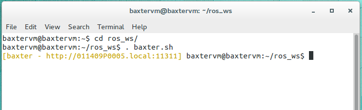
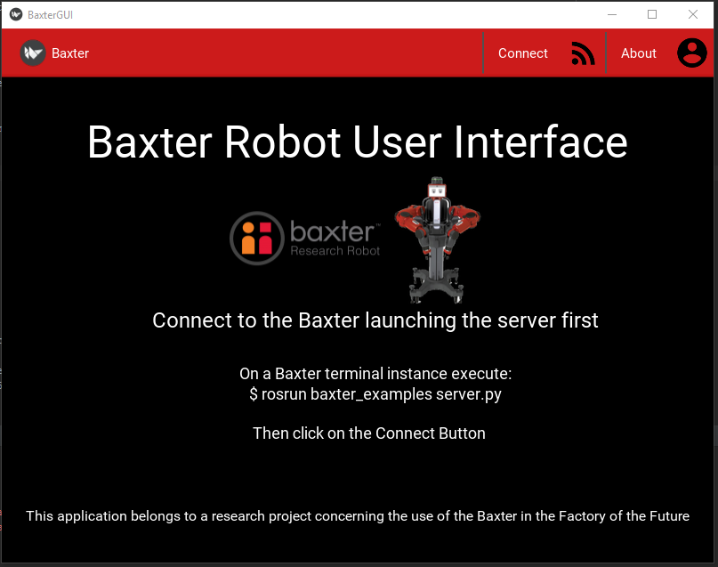

## Integrating Baxter Robot into the Factory of the Future

###
Project in Python with Baxter Research Robot - [Link](http://sdk.rethinkrobotics.com/wiki/Main_Page)

Check the pdf file for the project description

###Objetives
1. Installation of appropriate software as well as communication tools to create an integrated programming environment for Baxter Robot
2. Testing and gaining appropriate knowledge to work with Baxter Robot and its accessories.
3. Design and implementation of a simple operational scenario for Baxter Robot, to test the usability of the suggested communication model.
4. Develop a cross platform user interface to control some of the Baxter functions

#### Enviroment SetUp

* Follow the steps in the sdk website - [Link](http://sdk.rethinkrobotics.com/wiki/Workstation_Setup#Step_1:_Install_Ubuntu)
* Alternatively, if ubuntu 14.04 is already installed, you can run the installAll.sh script founded in the scripts folder, and optionally the simuInstall.sh which will add the simulator software   

#### About
* The "gui" folder holds the programs related with the objective of the project and the user interface.
* The "scritpts" folder holds some basics tools created for a fast and better use of the baxter
* The "python_basics" and "kivy" folders holds some demo and simple programs created in learning purposes
* The "testing" folder holds alternatives or older versions of files related to testing purposes 
* The "records" folder holds some text files recording specific coordinates for the programs (Not in use)

#### Working with Baxter
1. Asuming the Baxter is working and connected to the network, and the baxter.sh file is configured, in a terminal, run the baxter.sh script in your workstation
 
2. Enable the robot using `$ rosrun  baxter_tools enable_robot.py -e` (-d for disable) or run the script startStop.sh (Should be placed at the same level than baxter.sh)
3. Run the script at your choice via `rosrun`.
    * The scripts should be placed inside the source folder. I recommend putting them inside `$ ros_ws/src/baxter_examples`
    and then calling with `$ rosrun baxter_examples custom_script.py`
    
#### User Interface
1. Run the server.py in a instance of the baxter.sh script as mentioned before with `rosrun`
    * You may need to edit the ip address at the beginning of the file and locate all the files inside the ros_ws folder. Check cpCore.sh inside scripts folder to automate the process
2. Execute the client script via python in the same workstation or in other machine located in the same network with the correct IP address   

Notes: Careful if you try to run a process without ending via the client, due python scripts are executed using the baxter terminal instance you can't run more than one process for each instance